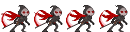

# Berserk Game Project

Currently, we see every time that games appear for all platforms, the root of that, most of the games that appear as innovators and are losing the classic games. Therefore, the game Berserk proposes to revive a classic game, in this case, the game Super Smash Bros is taken as a reference (Super Smash Bros., known in Japan as Nintendo All Star!).

## Installation

still in development

## First character designs

## Usage

still in development

## Contributing
Pull requests are welcome. For major changes, please open an issue first to discuss what you would like to change.

Please make sure to update tests as appropriate.

## License
[MIT](https://choosealicense.com/licenses/mit/)
